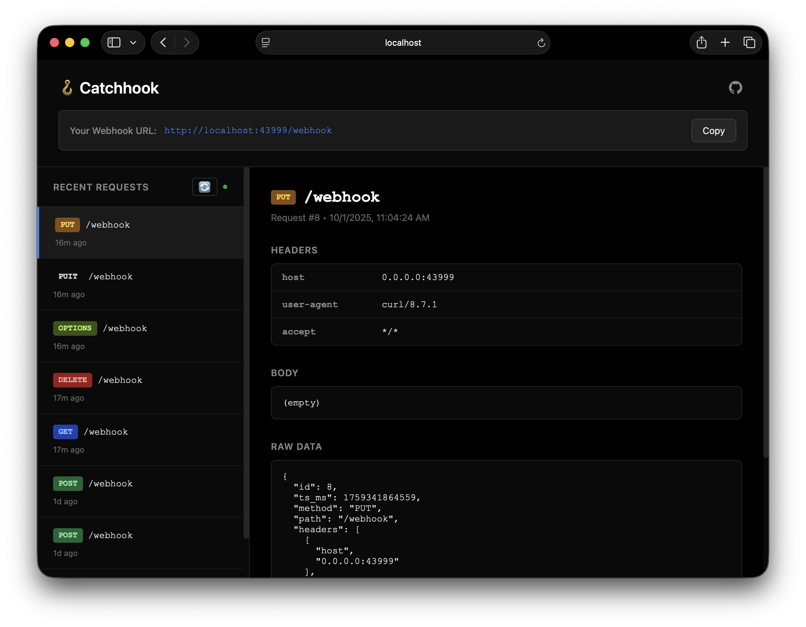

# 🪝 Catchhook

[](https://github.com/abimaelmartell/catchhook/actions/workflows/ci.yml)

A lightweight, self-hosted webhook testing tool that captures and displays HTTP requests in real-time.



## Features

- **Capture All HTTP Methods** - GET, POST, PUT, DELETE, PATCH, HEAD, OPTIONS
- **Real-time Inspection** - View headers, body (JSON/text/binary), and raw request data
- **Auto-refresh** - Updates every 5 seconds + refetch on window focus
- **Persistent Storage** - Requests are saved to disk with configurable limits
- **Modern UI** - Clean, dark-themed interface with method badges and time tracking
- **Zero Dependencies** - Self-contained binary with embedded static assets

## Quick Start

### Using Docker (Recommended)

```bash
# Using docker-compose
docker-compose up -d

# Or using docker directly
docker run -d \
  -p 43999:43999 \
  -v catchhook-data:/app/catchhook-data \
  ghcr.io/abimaelmartell/catchhook:latest
```

### From Source

```bash
# Build and run
cargo run --release

# Server starts at http://localhost:43999
# Send requests to http://localhost:43999/webhook
```

## Configuration

Environment variables:

- `CATCHHOOK_PORT` - Server port (default: `43999`)
- `CATCHHOOK_DATA` - Data directory path (default: `./catchhook-data`)
- `CATCHHOOK_MAX_REQS` - Maximum stored requests (default: `10000`)

### Docker Compose Example

```yaml
version: '3.8'

services:
  catchhook:
    image: ghcr.io/abimaelmartell/catchhook:latest
    ports:
      - "8080:43999"
    volumes:
      - ./data:/app/catchhook-data
    environment:
      - CATCHHOOK_PORT=43999
      - CATCHHOOK_MAX_REQS=5000
    restart: unless-stopped
```

### From Source

```bash
CATCHHOOK_PORT=8080 CATCHHOOK_DATA=/tmp/webhooks cargo run --release
```

## API Endpoints

- `GET /` - Web UI
- `GET /health` - Health check
- `ANY /webhook` - Webhook endpoint (accepts all HTTP methods)
- `GET /latest` - Get latest requests (JSON)
- `GET /req/{id}` - Get specific request by ID (JSON)

## Usage

1. Start the server
2. Open http://localhost:43999 in your browser
3. Copy the webhook URL
4. Send test requests:

```bash
curl -X POST http://localhost:43999/webhook \
  -H "Content-Type: application/json" \
  -d '{"test": "data"}'
```

5. View captured requests in the web UI

## Tech Stack

- **Backend**: Rust with Axum web framework
- **Storage**: File-based with redb (embedded database)
- **Frontend**: Vanilla JavaScript with modern CSS

## Docker

### Building Locally

```bash
# Build the image
docker build -t catchhook .

# Run the container
docker run -d -p 43999:43999 -v catchhook-data:/app/catchhook-data catchhook
```

### Publishing to Registry

The Docker image is automatically built and published to GitHub Container Registry on every push to main/master and on version tags.

Pull the latest image:
```bash
docker pull ghcr.io/abimaelmartell/catchhook:latest
```

## License

MIT
